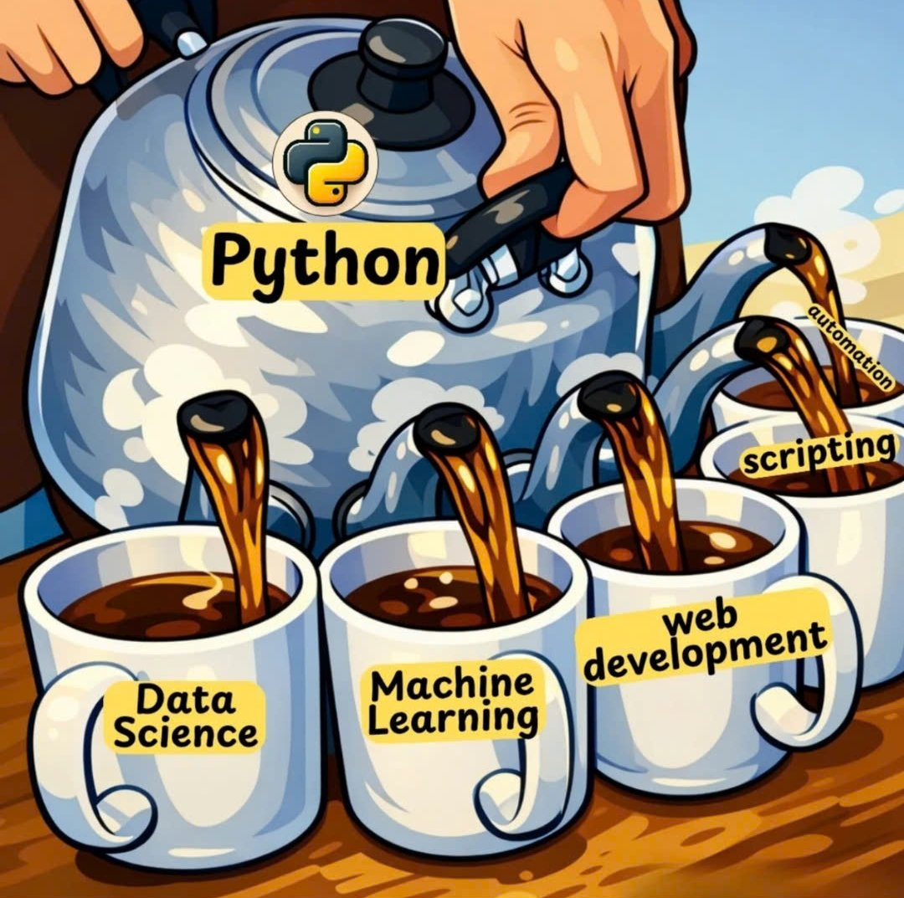
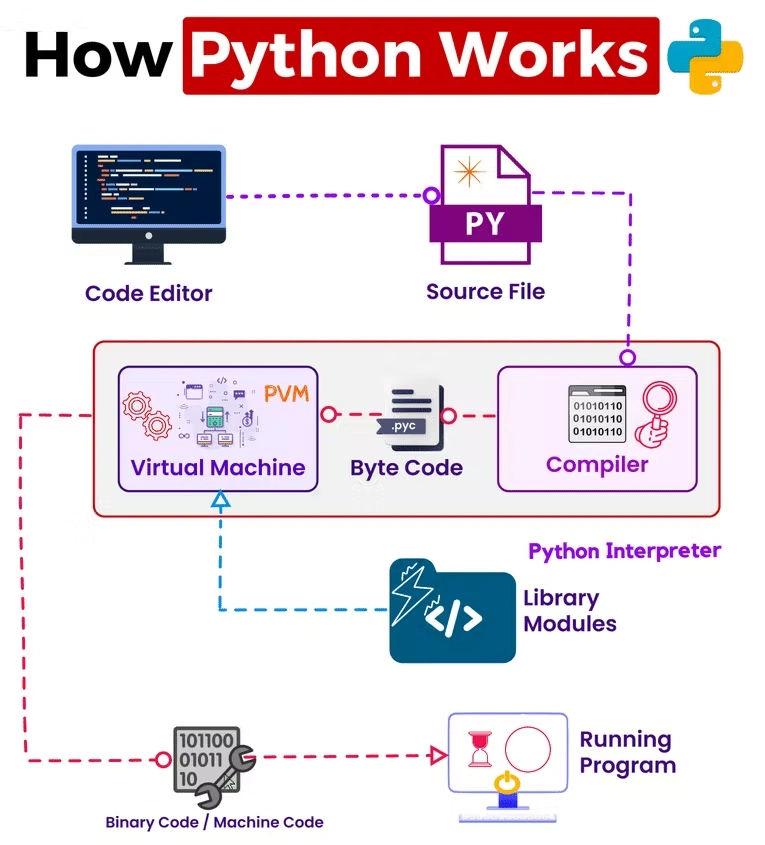
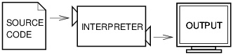
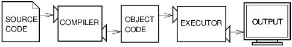
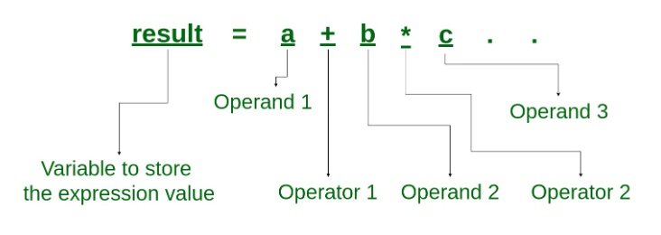
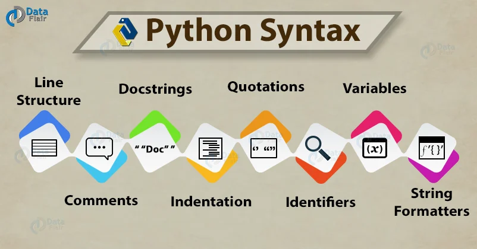

<!-- _class: title -->

# Chapter 1

Introduction to Python

*1.0 Intro - 1.1 Programming Concepts - 1.2 Basic Syntax*

*Use this deck to frame the first technical lab and homework.*

---

## Today's Route

1. Set up Python as a working language for this course
2. Read programs as formal instructions
3. Distinguish expressions, statements, and objects
4. Run small syntax examples in Jupyter
5. Prepare for the Chapter 01 technical lab

<div class="callout rule">

Goal: leave class able to run, inspect, and explain short Python programs.

</div>

---

## Python In This Course

<div class="cols">
<div>

- Programming first
- Data science as the applied context
- Jupyter for exploration
- Scripts and modules for reusable work

</div>
<div>



</div>
</div>

---

## Why Python?

<div class="cols">
<div>

- Readable syntax
- Interactive workflow
- Strong standard library
- Large package ecosystem
- Common in data, automation, AI, and web work

</div>
<div>

```python
scores = [72, 88, 95, 61, 79]
average = sum(scores) / len(scores)

print(f"Average: {average:.1f}")
```

<div class="callout">

Python is useful because it is expressive enough for real work and forgiving enough for fast iteration.

</div>

</div>
</div>

---

## Jupyter Workflow

<div class="cols">
<div>

- A notebook mixes prose, code, output, and media
- Cells run one at a time
- Output lets you inspect results immediately
- Markdown cells explain the reasoning around code

</div>
<div>

```python
name = "Ada"
print(f"Hello, {name}")
```

```text
Hello, Ada
```

</div>
</div>

---

<!-- _class: section -->

## 1.1 Programming Concepts

Programs, formal languages, abstraction, execution, expressions, number systems

---

## Natural Vs. Formal Languages

| Feature | Natural language | Programming language |
|---|---|---|
| Ambiguity | Often high | Designed to be low |
| Redundancy | Common | Usually minimal |
| Literalness | Context-dependent | Exact |
| Error tolerance | Humans infer intent | Interpreter requires valid syntax |

<div class="callout warn">

Small details such as spelling, quotes, commas, and indentation change program behavior.

</div>

---

## How Python Runs

<div class="cols">
<div>



</div>
<div>

1. You write source code
2. Python parses and compiles it to bytecode
3. The Python virtual machine executes the bytecode
4. Results appear as output or changed program state

</div>
</div>

---

## Interpreters And Compilers

<div class="cols">
<div>



**Interpreter:** runs code through a runtime system, often with fast feedback.

</div>
<div>



**Compiler:** translates source into another executable form before running.

</div>
</div>

---

## Core Programming Constructs

| Construct | Role | Python shape |
|---|---|---|
| Sequence | run steps in order | line after line |
| Selection | choose a path | `if`, `elif`, `else` |
| Iteration | repeat work | `for`, `while` |

Supporting pieces:

- variables
- operators
- functions
- types
- collections

---

## Expressions And Statements

<div class="cols">
<div>



</div>
<div>

**Expression:** evaluates to a value.

```python
2 + 3 * 4
len("data")
```

**Statement:** performs an action.

```python
x = 14
print(x)
```

</div>
</div>

---

## Worked Example: Trace Values

```python
unit_price = 18.75
quantity = 4
tax_rate = 0.0825

subtotal = unit_price * quantity
tax = subtotal * tax_rate
total = subtotal + tax

print(round(total, 2))
```

Checkpoint:

- Which lines are assignment statements?
- Which expressions evaluate to numbers?
- What value prints?

---

## Number Systems

| System | Base | Digits | Python literal |
|---|---:|---|---|
| Binary | 2 | `0`-`1` | `0b1101` |
| Octal | 8 | `0`-`7` | `0o15` |
| Decimal | 10 | `0`-`9` | `13` |
| Hexadecimal | 16 | `0`-`9`, `a`-`f` | `0xd` |

```python
print(0b1101)  # 13
print(0xd)     # 13
```

---

## Binary And Hex Helpers

```python
value = 64

print(bin(value))
print(oct(value))
print(hex(value))
```

```text
0b1000000
0o100
0x40
```

<div class="callout">

Use prefixes to read the base: `0b` binary, `0o` octal, `0x` hexadecimal.

</div>

---

## Character Encoding

<div class="cols">
<div>


</div>
<div>

Text is stored as numbers.

```python
print(ord("A"))
print(chr(65))
print(ord("C"))
print(bin(ord("C")))
```

```text
65
A
67
0b1000011
```

</div>
</div>

---

## Checkpoint: Section 1.1

Work with a partner:

```python
item_number = 64
product_code = "C"

print(hex(item_number))
print(ord(product_code))
```

1. Predict the two printed values.
2. Name one expression in the code.
3. Name one statement in the code.
4. Explain why `"C"` has a numeric representation.

---

<!-- _class: section -->

## 1.2 Basic Syntax

Indentation, formatting, `print`, f-strings, `input`, comments, objects, keywords, modules

---

## Syntax Is A Contract

<div class="cols">
<div>



</div>
<div>

Syntax rules tell Python where:

- statements begin and end
- strings begin and end
- blocks start and stop
- function calls receive arguments

<div class="callout warn">

Syntax errors are messages that the formal language rules were not met.

</div>

</div>
</div>

---

## Indentation Defines Blocks

```python
score = 88

if score >= 70:
    print("passing")
    print("keep practicing")

print("done")
```

```text
passing
keep practicing
done
```

<div class="callout rule">

Use four spaces per indentation level. Do not mix tabs and spaces.

</div>

---

## `print()` Basics

```python
print("Hello")
print("red", "blue")
print("red", "blue", sep="-")
print("next", end=" ")
print("line")
```

```text
Hello
red blue
red-blue
next line
```

Common parameters:

- `sep`: text between printed values
- `end`: text after the print call

---

## F-Strings

```python
dataset_name = "sales"
row_count = 128
column_count = 5

print(f"{dataset_name}: {row_count} rows x {column_count} columns")
```

```text
sales: 128 rows x 5 columns
```

Why f-strings matter:

- readable
- expression-friendly
- useful for clear reports

---

## `input()` Returns A String

```python
age_text = input("Age: ")
print(type(age_text))
```

To do arithmetic, convert:

```python
age = int(age_text)
years_until_30 = 30 - age

print(years_until_30)
```

<div class="callout warn">

If a value came from `input()`, assume it is text until you convert it.

</div>

---

## Comments And Docstrings

```python
# Convert a typed value before doing arithmetic.
minutes_text = "135"
total_minutes = int(minutes_text)
```

```python
def minutes_to_hours(total_minutes):
    """Return whole hours and leftover minutes."""
    return total_minutes // 60, total_minutes % 60
```

Use comments for assumptions, non-obvious decisions, and TODO markers.

---

## Objects: Type, Value, Identity

```python
x = 42

print(type(x))
print(id(x))
print(x)
```

Every object has:

- a type
- a value
- an identity

<div class="callout">

For now, use `type()` to inspect what kind of value a variable refers to.

</div>

---

## Keywords Are Reserved

```python
import keyword

print(keyword.kwlist[:8])
```

| Category | Examples |
|---|---|
| Decisions | `if`, `elif`, `else` |
| Repetition | `for`, `while`, `break` |
| Definitions | `def`, `class`, `return` |
| Imports | `import`, `from`, `as` |

Do not use keywords as variable names.

---

## Modules And Packages

```python
import math
from collections import Counter

radius = 3
area = math.pi * radius ** 2

letters = Counter("banana")
```

| Term | Meaning |
|---|---|
| Module | one Python file |
| Package | a folder of modules |
| Library | a broader reusable collection |

---

## Checkpoint: Section 1.2

Write a short program that:

1. Stores `dataset_name = "sales"`
2. Stores `row_count = 128`
3. Stores `column_count = 5`
4. Prints `sales: 128 rows x 5 columns`
5. Prints `sales|128|5`

Use one f-string and one `print(..., sep="|")`.

---

## Lab 01 Bridge

The lab extends these section exercises.

You will write code for:

- a first runnable program
- expressions and assignment statements
- formatted output
- string-to-number conversion
- number-system and encoding helpers

<div class="callout rule">

The lab questions are technical coding questions in the same format as section exercises.

</div>

---

## Chapter 1 Recap

You should now be able to:

- explain Python as a formal language
- distinguish expressions from statements
- trace short assignment-based programs
- use `print`, f-strings, and basic conversion
- inspect values with `type`, `bin`, `hex`, `ord`, and `chr`
- recognize why syntax details matter

---

<!-- _class: title -->

# Next

Chapter 2: Variables, Operators, And Types

*Bring the Chapter 01 lab questions to the next class discussion.*
