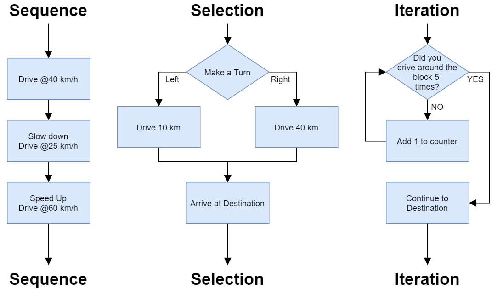

<!-- _class: title -->

# Chapter 3

Control Flow

*3.0 Intro · 3.1 Conditionals · 3.2 Iteration*

*← → or Space to navigate · F for fullscreen*

---

## What Changes in Chapter 3

<div class="cols-40">
<div>

- Until now, code mostly ran top-to-bottom.
- Control flow lets a program choose paths and repeat work.
- The two core patterns are **selection** and **iteration**.

<div class="callout">

The practical question is: which statement should run next?

</div>

</div>
<div>



</div>
</div>

---

## Control-Flow Families

<div class="tiny">

| Type | Statement | Role in Python programs |
|---|---|---|
| Conditional | `if` / `else` | Choose between branches based on a Boolean condition. |
| Conditional | `elif` | Add another tested branch in a chain. |
| Looping | `for` | Repeat once for each item in an iterable. |
| Looping | `while` | Repeat while a condition remains true. |
| Looping | `while True` + `break` | Repeat until an internal stopping condition is reached. |
| Jump/control | `break` | Exit the nearest loop immediately. |
| Jump/control | `continue` | Skip the rest of this iteration and start the next one. |
| Jump/control | `return` | Leave a function and send a value back to the caller. |

</div>

<div class="callout rule">

Python does not use `goto`, and this chapter does not cover `match` / `case`.

</div>

---

## Chapter Route

| Notebook | Main job | Students should be able to |
|---|---|---|
| `0300-control-flow` | Big picture | Explain selection vs. iteration. |
| `0301-conditionals` | Branching | Write `if`, `else`, `elif`, nested conditions, and conditional expressions. |
| `0302-iteration` | Repetition | Choose among `for`, `while`, `break`, `continue`, and accumulators. |

---

<!-- _class: section -->

## 3.1 Conditionals

Boolean expressions · branches · chained decisions · nested decisions · conditional expressions

---

## Conditional Forms

<div class="cols">
<div>

| Form | Syntax | Use when |
|---|---|---|
| Conditional execution | `if` | A block may or may not run. |
| Alternative execution | `if` / `else` | Exactly one of two branches should run. |
| Chained conditional | `if` / `elif` / `else` | More than two outcomes are possible. |
| Nested conditional | `if` inside `if` | A second decision depends on the first. |
| Conditional expression | `A if test else B` | Choosing between two simple values. |

</div>
<div>

```python
score = 85

if score >= 90:
    grade = "A"
elif score >= 80:
    grade = "B"
elif score >= 70:
    grade = "C"
else:
    grade = "F"
```

<div class="callout">

Conditions are checked from top to bottom. The first true branch wins.

</div>

</div>
</div>

---

## Boolean Expressions Feed Branches

<div class="cols">
<div>

```python
x = 5

if x > 0:
    print("x is positive")
```

```python
num = 12

if num % 2 == 0:
    print("even")
else:
    print("odd")
```

</div>
<div>

- A Boolean expression evaluates to `True` or `False`.
- Comparison operators create Boolean values.
- Logical operators combine tests: `and`, `or`, `not`.
- Indentation defines the branch body.

<div class="callout warn">

`%` appears here only as an operator used in a condition. The operator itself belongs in Chapter 2.

</div>

</div>
</div>

---

## Nested vs. Combined Conditions

<div class="cols">
<div>

```python
if username == "admin":
    if password == "secret":
        print("Access granted")
    else:
        print("Wrong password")
else:
    print("Unknown user")
```

</div>
<div>

```python
if username == "admin" and password == "secret":
    print("Access granted")
```

```python
if 0 < x < 10:
    print("single digit")
```

<div class="callout rule">

Nest when decisions genuinely depend on prior branches. Combine tests when the condition remains readable.

</div>

</div>
</div>

---

## Conditional Expressions

Use a conditional expression when the whole decision is a simple value choice.

<div class="cols">
<div>

```python
age = 20

if age >= 18:
    status = "adult"
else:
    status = "minor"
```

</div>
<div>

```python
age = 20

status = "adult" if age >= 18 else "minor"
```

```python
label = "even" if n % 2 == 0 else "odd"
```

<div class="callout">

Use this form for compact assignments, not for large blocks of work.

</div>

</div>
</div>

---

<!-- _class: section -->

## 3.2 Iteration

iterables · `for` patterns · `while` patterns · loop control · accumulators

---

## Iterables and Iterators

<div class="cols">
<div>

```python
fruit = ("apple", "banana", "cherry")

itr = iter(fruit)

print(next(itr))  # apple
print(next(itr))  # banana
print(next(itr))  # cherry
```

</div>
<div>

| Term | Meaning |
|---|---|
| Iterable | Object that can provide values one at a time. |
| Iterator | Object that remembers the current position. |
| `iter()` | Requests an iterator from an iterable. |
| `next()` | Pulls the next value from an iterator. |

<div class="callout">

A `for` loop uses this machinery automatically.

</div>

</div>
</div>

---

## `for` Loop Patterns

<div class="tiny">

| Pattern | Typical syntax | Iterates over | Best use case |
|---|---|---|---|
| Basic for-each | `for x in collection:` | Elements | Processing values directly |
| `range()` counting | `for i in range(n):` | Numbers | Counting and fixed repeats |
| Index-based | `for i in range(len(lst)):` | Positions | Updating by index |
| `enumerate()` | `for i, x in enumerate(lst):` | Index + value | Cleaner indexed loops |
| Nested loop | `for x in A: for y in B:` | Combinations | Tables, grids, matrices |

</div>

```python
for fruit in ["apple", "banana", "cherry"]:
    print(fruit)

for i, fruit in enumerate(["apple", "banana"]):
    print(i, fruit)
```

---

## Choosing the Right `for`

<div class="cols">
<div>

```python
# Direct iteration
for amount in rainfall:
    print(amount)
```

```python
# Index-based update
for i in range(len(numbers)):
    numbers[i] *= 2
```

</div>
<div>

```python
# Parallel sequences
for name, score in zip(names, scores):
    print(name, score)
```

```python
# Dictionary items
for name, score in scores.items():
    print(name, score)
```

</div>
</div>

---

## Nested Loops

<div class="cols">
<div>

```python
for row in range(1, 4):
    for col in range(1, 4):
        print(row * col, end=" ")
    print()
```

</div>
<div>

```python
matrix = [
    [1, 2, 3],
    [4, 5, 6],
]

for row in matrix:
    for value in row:
        print(value)
```

<div class="callout">

The inner loop completes once for each value produced by the outer loop.

</div>

</div>
</div>

---

## `while` Loop Patterns

<div class="tiny">

| Type | Controlled by | Ends when | Best for |
|---|---|---|---|
| Counting `while` | Number condition | Condition becomes false | Repetition with counters |
| Sentinel `while` | Special value | Sentinel is entered | User input loops |
| `while True` | `break` | `break` executes | Menus, games, event loops |

</div>

```python
times = 0

while times < 3:
    print("Hello!")
    times += 1
```

<div class="callout warn">

Every `while` loop needs a realistic path to stopping.

</div>

---

## Sentinel and `while True`

<div class="cols">
<div>

```python
total = 0
value = int(input("Number? "))

while value != -1:
    total += value
    value = int(input("Number? "))
```

</div>
<div>

```python
total = 0

while True:
    value = int(input("Number? "))

    if value == -1:
        break

    total += value
```

</div>
</div>

---

## Loop Control: `pass` vs. `continue`

<div class="tiny">

| Feature | `pass` | `continue` |
|---|---|---|
| Meaning | Do nothing. | Skip to the next iteration. |
| Where allowed | Loops, functions, classes, `if` statements. | Only inside loops. |
| Flow effect | Continues with the next statement. | Jumps back to the loop header. |
| Main use | Placeholder for unfinished code. | Skip selected items. |

</div>

<div class="cols">
<div>

```python
if x < 0:
    pass
```

</div>
<div>

```python
for n in range(10):
    if n % 2 == 0:
        continue
    print(n)
```

</div>
</div>

---

## Accumulator Pattern

<div class="cols">
<div>

```python
rainfall = [0.2, 0.0, 1.3, 0.4]

total = 0
for amount in rainfall:
    total += amount

print(total)
```

</div>
<div>

```python
wet_days = 0
for amount in rainfall:
    if amount > 0:
        wet_days += 1

print(wet_days)
```

<div class="callout rule">

Set the accumulator before the loop. Update it inside the loop. Use it after the loop.

</div>

</div>
</div>

---

## Chapter 3 Checklist

| Skill | Check |
|---|---|
| Trace control flow | Can you predict which branch or loop body runs next? |
| Write branches | Can you choose among `if`, `else`, `elif`, and nested `if`? |
| Choose loops | Can you decide between `for` and `while`? |
| Control loops | Can you explain `break`, `continue`, and `pass`? |
| Accumulate results | Can you total, count, or collect values in a loop? |

---

<!-- _class: title -->

# End of Chapter 3

*Next: Chapter 4 — Functions*

*defining functions · parameters · return values · recursion*
